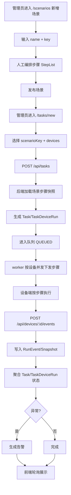

# Phase 1 设计文档（可靠与透明）

## 1. 系统定义

### 1.1 系统目标

* 在少量金丝雀设备上跑通“签到/任务领奖”最小闭环，确保可执行、可观测、可追溯。

* 采用“场景 + 人工编排步骤”的统一执行模型，避免并行执行概念造成理解分歧。

* 将失败、重试、超时等异常统一收敛到告警与审计链路，形成可定位、可回放的闭环。

### 1.2 Phase 1 范围

* 包含：设备注册/心跳、任务创建与下发、事件与截图回传、任务看板、日志检索、失败告警、RBAC 与 HMAC 基础安全。

* 包含：场景（Scenario）管理与人工步骤编排，支持按场景复用步骤定义。

* 不包含：管理端 AI 决策引擎、自动审批流，仅预留扩展字段与人工规则开关。

### 1.3 术语与边界

* Scenario：业务语义与执行定义载体，包含场景名称、场景 key、步骤清单。

* Step：场景中的一个可执行步骤，由人工编排顺序与参数。

* Task：一次调度实例（谁、何时、按哪个场景执行）。

* TaskDeviceRun：Task 在单设备维度的运行实例。

* RunEvent / Snapshot：运行证据与时间线。

### 1.4 核心设计原则

* 场景创建只要求 `name` 与 `key`，步骤由运营或管理员人工编排。

* 任务执行仅基于场景步骤与步骤顺序。

* 任务运行快照冻结步骤版本，运行中任务不受场景后续编辑影响。

## 2. 系统组成与作用

### 2.1 逻辑分层

* 业务层：Scenario 承载运营语义、统计口径与权限挂载。

* 编排层：StepList 承载人工步骤定义、顺序、参数与前置条件。

* 调度层：Task 入队、并发控制、重试退避、分发执行。

* 执行层：设备按步骤顺序执行动作，回传状态流与证据。

* 证据层：RunEvent/Snapshot 持久化，提供日志检索与失败回放。

* 治理层：RBAC、设备鉴权、HMAC 验签、敏感页面标记与审计。

### 2.2 后端模块

* api-rest：对外 API（设备、场景、任务、日志、告警）。

* core-domain：领域模型、状态机、步骤编排校验与执行规则。

* worker：队列消费、并发限制、下发编排、超时与重试控制。

* storage：关系数据持久化与对象存储引用（截图/日志）。

### 2.3 前端模块

* 设备视图：/devices 展示在线、心跳、能力集、就绪状态。

* 场景管理视图：/scenarios 管理场景基本信息与步骤清单。

* 任务创建页：/tasks/new 选择场景与设备后创建任务。

* 任务详情页：/tasks/:id 展示设备子任务、时间线、截图证据。

* 观测页面：/logs、/alerts 提供检索与异常聚合。

### 2.4 设备端（AutoGLM For Android）职责

* 设备能力上报：心跳汇报状态、能力、网络、电量、前台包名等。

* 指令执行：按场景步骤逐条执行动作。

* 证据回传：关键节点回传 RunEvent、截图引用、错误码与轨迹摘要。

* 安全配合：携带 token 与 hmac，满足服务端鉴权与验签。

### 2.5 关键标识

* scenarioKey、scenarioId、stepId、taskId、runId、eventId。

## 3. 功能定义、字段、流程与数据流向

### 3.1 端到端主流程



### 3.2 功能 A：设备注册与就绪管理

* 目标：建立设备身份、能力画像与在线状态，作为调度前提。

* 关键接口：

  * POST /api/devices/register

  * POST /api/devices/heartbeat

  * GET /api/devices/:id/status

  * GET /api/devices/:id/readiness

* 关键字段：

  * 注册：deviceId、brand、model、androidVersion、resolution、capabilities\[]、shizukuAvailable、overlayGranted、keyboardEnabled。

  * 心跳：foregroundPkg、batteryPct、networkType、charging、sseSupported。

  * 就绪：shizukuRunning、overlayGranted、keyboardEnabled、lastActivationMethod。

* 操作流程：

  * 首次注册发放 token。

  * 周期心跳刷新在线与就绪状态。

  * 前端 /devices 轮询展示设备可用性与能力。

* 数据流向：

  * 设备端 -> API -> Device/DeviceReadiness 持久化 -> 前端查询展示。

### 3.3 功能 B：场景管理与人工步骤编排

* 目标：统一“业务语义”和“执行步骤”，降低配置复杂度。

* 关键接口：

  * GET /api/scenarios

  * POST /api/scenarios

  * GET /api/scenarios/:key

  * PUT /api/scenarios/:key/steps

* 关键字段：

  * ScenarioDefinition：scenarioId、key、name、description、status、createdBy、updatedAt。

  * ScenarioStep：stepId、scenarioKey、orderNo、action、params、timeoutMs、retryPolicy、enabled。

* 操作流程：

  * 新增场景时仅填写 `name` 和 `key`。

  * 创建完成后进入步骤编排页，人工维护步骤顺序与动作参数。

  * 场景发布后可被任务创建引用。

* 数据流向：

  * 前端场景管理页 -> ScenarioDefinition/ScenarioStep 持久化 -> 任务创建页读取。

### 3.4 功能 C：任务创建与场景绑定

* 目标：统一任务入口，保证任务只绑定场景与步骤快照。

* 关键接口：POST /api/tasks、GET /api/tasks/:taskId。

* 字段规则：

  * 必填：scenarioKey、devices\[]、priority。

  * 可选：constraints（deadlineMs、maxRetries）、observability（snapshotLevel、logDetail）。

  * 不再接收历史兼容执行字段，仅保留场景化创建字段。

* 操作流程：

  * 前端选择场景和设备后提交任务。

  * 后端校验场景状态与步骤可用性。

  * 后端将场景步骤固化为任务快照并生成 Task/TaskDeviceRun（QUEUED）。

* 数据流向：

  * 前端 -> POST /api/tasks -> Task/TaskDeviceRun 入库 -> worker 消费。

### 3.5 功能 D：调度与下发执行

* 目标：在多设备下稳定执行，控制并发、超时、重试。

* 关键对象：

  * Task 状态：QUEUED -> DISPATCHING -> RUNNING -> SUCCESS/FAIL/CANCELED。

  * TaskDeviceRun 状态：PENDING -> RUNNING -> SUCCESS/FAIL。

  * StepInstance：任务快照中的步骤执行实例。

* 关键字段：

  * priority、constraints.maxRetries、deadlineMs、stepId、orderNo、action、params、timeoutMs、retryPolicy。

* 操作流程：

  * worker 按设备并发限制取队列任务。

  * 依次下发步骤列表，设备按 `orderNo` 执行。

  * 设备执行中持续回传事件，后端按事件更新运行态。

* 数据流向：

  * Task 队列 -> worker -> 设备端 -> 事件回传 -> 聚合状态。

### 3.6 功能 E：事件、日志与证据链

* 目标：保证运行过程可解释、可审计、可回放。

* 关键接口：

  * POST /api/devices/:id/events

  * GET /api/logs?taskId=...\&deviceId=...

* 关键字段：

  * taskId、stepId、status、timestamp、durationMs、screenshotUrl、errorCode、trace\[]、thinking、sensitiveScreenDetected、progress、hmac。

  * Snapshot：elements\[{text,bounds,confidence,role}]、foregroundPkg、screenshotUrl、timestamp。

* 操作流程：

  * 设备在关键节点上报 RUNNING/SUCCESS/FAIL 事件。

  * 后端验签、幂等写入、关联 runId/eventId。

  * 前端按任务与设备检索时间线与证据。

* 数据流向：

  * 设备端 -> 事件 API -> RunEvent/Snapshot -> 日志检索接口 -> 前端时间线。

### 3.7 功能 F：异常识别与告警

* 目标：将失败、超时、重试超阈值统一告警化。

* 关键接口：GET /api/alerts?taskId=...

* 关键字段：

  * errorCode、retryCount、timeoutFlag、taskId、runId、stepId、riskTag。

  * 常见错误码：SHIZUKU\_NOT\_RUNNING、OVERLAY\_NOT\_GRANTED、KEYBOARD\_NOT\_ENABLED、SENSITIVE\_SCREEN\_BLACKOUT、API\_CONNECTION\_FAILED、MODEL\_TIMEOUT。

* 操作流程：

  * 聚合器根据 RunEvent 与运行状态判断异常。

  * 生成告警记录并在 /alerts 展示。

  * 前端支持跳转至任务详情失败节点。

* 数据流向：

  * RunEvent 聚合 -> Alert 记录 -> 告警查询与定位。

### 3.8 功能 G：安全与权限治理

* 目标：确保设备身份可信、操作可审计、最小权限可控。

* 关键机制：

  * RBAC：管理员/运营/只读。

  * 设备鉴权：注册 token + 事件 hmac 验签与时效校验。

  * 审计：关键操作、人工操作、关键事件写入审计流。

  * 敏感页面：仅保存引用与标记，避免敏感内容泄露。

* 数据流向：

  * 用户/设备请求 -> 鉴权验签 -> 业务处理 -> 审计记录落库。

## 4. 核心数据模型与关系

### 4.1 核心实体

* ScenarioDefinition、ScenarioStep、Device、DeviceReadiness、Task、TaskDeviceRun、StepInstance、RunEvent、Snapshot。

### 4.2 关系约束

* ScenarioDefinition 1:N ScenarioStep。

* Task N:1 ScenarioDefinition。

* Task 1:N TaskDeviceRun；TaskDeviceRun 1:N RunEvent。

* Task 1:N StepInstance（任务创建时由场景步骤快照生成）。

* Snapshot 通过 eventId 或 runId 关联时间线证据。

### 4.3 配置与发布约束

* Scenario.status：DRAFT -> ACTIVE -> DEPRECATED。

* 新任务仅可绑定 ACTIVE 场景，且场景步骤至少 1 条。

* 运行中任务冻结步骤快照，不受场景后续编辑影响。

## 5. 前端交互与展示口径

### 5.1 页面与轮询

* /devices、/scenarios、/tasks/new、/tasks/:id、/logs、/alerts。

* 列表与详情默认 3s 轮询，支持手动刷新。

* 截图低频加载、懒加载与占位显示。

### 5.2 创建任务约束

* 必须选择 scenarioKey 与 devices。

* 不展示额外执行方式选择控件。

* 高级模式仅允许覆盖约束参数，不改写步骤顺序。

### 5.3 统一展示字段

* 列表、详情、日志、告警统一展示 scenarioKey、scenarioName。

* 详情页展示步骤执行进度：总步骤数、当前步骤、失败步骤。

* 设备侧展示 shizuku/overlay/keyboard 就绪徽标。

## 6. 成功标准（Phase 1）

* 可靠性：签到类场景成功率达到既定阈值（示例 90%+）。

* 一致性：任务 100% 绑定 scenarioKey，且存在步骤快照。

* 完整性：关键节点事件与证据完整可查。

* 可追溯：失败可回溯到场景、步骤、设备运行实例与证据链。

* 可运营：失败、超时、重试超阈告警准确聚合并可快速定位。

## 7. 里程碑

* M1：设备注册/心跳与状态看板。

* M2：场景创建（name/key）+ 人工步骤编排 + 任务绑定。

* M3：步骤顺序执行 + 关键节点快照。

* M4：失败告警、验收通过、金丝雀试跑报告。

## 8. 数据库表设计（PostgreSQL）

### 8.1 设计约束（对齐阿里巴巴数据库规范）

* 数据库：PostgreSQL 15+。

* 命名：表名、字段名、索引名统一小写下划线风格。

* 表名前缀：统一使用 `t_`，表达“业务表”语义。

* 主键：统一 `bigint` 自增主键，避免业务语义主键。

* 关联：不使用外键约束，统一在应用层维护引用完整性。

* 审计：每张表必须包含审计字段（见 8.2）。

* 删除：统一逻辑删除，不做物理删除。

### 8.2 统一审计字段（每张表必备）

* `creator`：创建人。

* `modifier`：修改人。

* `gmt_create`：创建时间。

* `gmt_modified`：修改时间。

* `is_deleted`：逻辑删除标记（0=未删除，1=已删除）。

* `deleter`：删除人。

* `gmt_deleted`：删除时间。

### 8.3 表结构设计（无外键）

#### 8.3.1 t\_scenario（场景定义表）

* 用途：管理场景主数据（名称、唯一 key、状态）。

* 唯一约束：`uk_t_scenario_key(scenario_key)`。

* 关键索引：`idx_t_scenario_status(status, gmt_create desc)`。

| 字段名            | 类型           | 约束/默认值                    | 中文注释                          |
| -------------- | ------------ | ------------------------- | ----------------------------- |
| id             | bigint       | pk, identity              | 主键ID                          |
| scenario\_key  | varchar(64)  | not null                  | 场景唯一标识Key                     |
| scenario\_name | varchar(128) | not null                  | 场景名称                          |
| scenario\_desc | varchar(500) | null                      | 场景描述                          |
| status         | varchar(16)  | not null default 'DRAFT'  | 场景状态（DRAFT/ACTIVE/DEPRECATED） |
| version\_no    | bigint       | not null default 1        | 场景版本号（每次发布递增）                 |
| creator        | varchar(64)  | not null default 'system' | 创建人                           |
| modifier       | varchar(64)  | not null default 'system' | 修改人                           |
| gmt\_create    | timestamptz  | not null default now()    | 创建时间                          |
| gmt\_modified  | timestamptz  | not null default now()    | 修改时间                          |
| is\_deleted    | smallint     | not null default 0        | 逻辑删除标记（0未删除，1已删除）             |
| deleter        | varchar(64)  | null                      | 删除人                           |
| gmt\_deleted   | timestamptz  | null                      | 删除时间                          |

#### 8.3.2 t\_scenario\_step（场景步骤表）

* 用途：存储场景内的人工编排步骤。

* 业务关联：`scenario_id` 逻辑关联 `t_scenario.id`（无外键）。

* 唯一约束：`uk_t_scenario_step_order(scenario_id, step_no, is_deleted)`。

| 字段名                | 类型           | 约束/默认值                    | 中文注释              |
| ------------------ | ------------ | ------------------------- | ----------------- |
| id                 | bigint       | pk, identity              | 主键ID              |
| scenario\_id       | bigint       | not null                  | 场景ID（逻辑关联）        |
| step\_no           | int          | not null                  | 步骤序号（从1开始）        |
| step\_name         | varchar(128) | not null                  | 步骤名称              |
| action\_code       | varchar(64)  | not null                  | 动作编码              |
| action\_params     | jsonb        | not null default '{}'     | 动作参数JSON          |
| timeout\_ms        | int          | not null default 5000     | 步骤超时时间（毫秒）        |
| retry\_max         | int          | not null default 0        | 最大重试次数            |
| retry\_backoff\_ms | int          | not null default 1000     | 重试退避时间（毫秒）        |
| is\_enabled        | smallint     | not null default 1        | 是否启用（0禁用，1启用）     |
| creator            | varchar(64)  | not null default 'system' | 创建人               |
| modifier           | varchar(64)  | not null default 'system' | 修改人               |
| gmt\_create        | timestamptz  | not null default now()    | 创建时间              |
| gmt\_modified      | timestamptz  | not null default now()    | 修改时间              |
| is\_deleted        | smallint     | not null default 0        | 逻辑删除标记（0未删除，1已删除） |
| deleter            | varchar(64)  | null                      | 删除人               |
| gmt\_deleted       | timestamptz  | null                      | 删除时间              |

#### 8.3.3 t\_device（设备主表）

* 用途：存储设备静态信息与鉴权信息。

* 唯一约束：`uk_t_device_code(device_code)`。

| 字段名              | 类型           | 约束/默认值                     | 中文注释                             |
| ---------------- | ------------ | -------------------------- | -------------------------------- |
| id               | bigint       | pk, identity               | 主键ID                             |
| device\_code     | varchar(128) | not null                   | 设备唯一编码                           |
| brand            | varchar(64)  | not null                   | 设备品牌                             |
| model            | varchar(64)  | not null                   | 设备型号                             |
| android\_version | varchar(32)  | not null                   | Android系统版本                      |
| resolution       | varchar(32)  | not null                   | 屏幕分辨率                            |
| capability\_json | jsonb        | not null default '\[]'     | 设备能力集合JSON                       |
| token\_hash      | varchar(256) | not null                   | 设备鉴权Token哈希值                     |
| device\_status   | varchar(16)  | not null default 'OFFLINE' | 设备状态（ONLINE/OFFLINE/UNAVAILABLE） |
| last\_seen\_at   | timestamptz  | null                       | 最近心跳时间                           |
| creator          | varchar(64)  | not null default 'system'  | 创建人                              |
| modifier         | varchar(64)  | not null default 'system'  | 修改人                              |
| gmt\_create      | timestamptz  | not null default now()     | 创建时间                             |
| gmt\_modified    | timestamptz  | not null default now()     | 修改时间                             |
| is\_deleted      | smallint     | not null default 0         | 逻辑删除标记（0未删除，1已删除）                |
| deleter          | varchar(64)  | null                       | 删除人                              |
| gmt\_deleted     | timestamptz  | null                       | 删除时间                             |

#### 8.3.4 t\_device\_readiness（设备就绪快照表）

* 用途：存储设备就绪状态与最近心跳信息。

* 业务关联：`device_id` 逻辑关联 `t_device.id`（无外键）。

* 唯一约束：`uk_t_device_readiness_device(device_id, is_deleted)`。

| 字段名                    | 类型           | 约束/默认值                    | 中文注释               |
| ---------------------- | ------------ | ------------------------- | ------------------ |
| id                     | bigint       | pk, identity              | 主键ID               |
| device\_id             | bigint       | not null                  | 设备ID（逻辑关联）         |
| foreground\_pkg        | varchar(256) | null                      | 前台应用包名             |
| battery\_pct           | int          | null                      | 电量百分比（0-100）       |
| network\_type          | varchar(32)  | null                      | 网络类型（WIFI/4G/5G）   |
| is\_charging           | smallint     | not null default 0        | 是否充电（0否，1是）        |
| is\_shizuku\_available | smallint     | not null default 0        | Shizuku是否可用（0否，1是） |
| is\_overlay\_granted   | smallint     | not null default 0        | 悬浮窗权限是否授予（0否，1是）   |
| is\_keyboard\_enabled  | smallint     | not null default 0        | 辅助输入是否启用（0否，1是）    |
| is\_sse\_supported     | smallint     | not null default 0        | 设备是否支持SSE（0否，1是）   |
| heartbeat\_at          | timestamptz  | not null default now()    | 最近一次心跳时间           |
| creator                | varchar(64)  | not null default 'system' | 创建人                |
| modifier               | varchar(64)  | not null default 'system' | 修改人                |
| gmt\_create            | timestamptz  | not null default now()    | 创建时间               |
| gmt\_modified          | timestamptz  | not null default now()    | 修改时间               |
| is\_deleted            | smallint     | not null default 0        | 逻辑删除标记（0未删除，1已删除）  |
| deleter                | varchar(64)  | null                      | 删除人                |
| gmt\_deleted           | timestamptz  | null                      | 删除时间               |

#### 8.3.5 t\_task（任务主表）

* 用途：存储任务主数据、状态与统计信息。

* 唯一约束：`uk_t_task_no(task_no)`。

* 索引：`idx_t_task_status_priority(status, priority desc, gmt_create desc)`。

| 字段名                    | 类型           | 约束/默认值                    | 中文注释                                       |
| ---------------------- | ------------ | ------------------------- | ------------------------------------------ |
| id                     | bigint       | pk, identity              | 主键ID                                       |
| task\_no               | varchar(64)  | not null                  | 任务编号                                       |
| scenario\_id           | bigint       | not null                  | 场景ID（逻辑关联）                                 |
| scenario\_key          | varchar(64)  | not null                  | 场景Key快照                                    |
| scenario\_name         | varchar(128) | not null                  | 场景名称快照                                     |
| status                 | varchar(16)  | not null default 'QUEUED' | 任务状态（QUEUED/RUNNING/SUCCESS/FAIL/CANCELED） |
| priority               | int          | not null default 5        | 优先级（数值越大优先级越高）                             |
| task\_constraints      | jsonb        | not null default '{}'     | 任务约束JSON                                   |
| observability          | jsonb        | not null default '{}'     | 观测配置JSON                                   |
| total\_device\_count   | int          | not null default 0        | 目标设备总数                                     |
| success\_device\_count | int          | not null default 0        | 成功设备数                                      |
| fail\_device\_count    | int          | not null default 0        | 失败设备数                                      |
| started\_at            | timestamptz  | null                      | 任务开始时间                                     |
| finished\_at           | timestamptz  | null                      | 任务结束时间                                     |
| creator                | varchar(64)  | not null default 'system' | 创建人                                        |
| modifier               | varchar(64)  | not null default 'system' | 修改人                                        |
| gmt\_create            | timestamptz  | not null default now()    | 创建时间                                       |
| gmt\_modified          | timestamptz  | not null default now()    | 修改时间                                       |
| is\_deleted            | smallint     | not null default 0        | 逻辑删除标记（0未删除，1已删除）                          |
| deleter                | varchar(64)  | null                      | 删除人                                        |
| gmt\_deleted           | timestamptz  | null                      | 删除时间                                       |

#### 8.3.6 t\_task\_device\_run（任务设备运行表）

* 用途：存储任务在设备维度的执行过程。

* 业务关联：`task_id`、`device_id` 均为逻辑关联。

* 唯一约束：`uk_t_task_device_run(task_id, device_id, is_deleted)`。

| 字段名               | 类型           | 约束/默认值                     | 中文注释                               |
| ----------------- | ------------ | -------------------------- | ---------------------------------- |
| id                | bigint       | pk, identity               | 主键ID                               |
| task\_id          | bigint       | not null                   | 任务ID（逻辑关联）                         |
| device\_id        | bigint       | not null                   | 设备ID（逻辑关联）                         |
| run\_status       | varchar(16)  | not null default 'PENDING' | 运行状态（PENDING/RUNNING/SUCCESS/FAIL） |
| current\_step\_no | int          | null                       | 当前执行步骤序号                           |
| retry\_count      | int          | not null default 0         | 已重试次数                              |
| error\_code       | varchar(64)  | null                       | 错误码                                |
| error\_message    | varchar(500) | null                       | 错误描述                               |
| started\_at       | timestamptz  | null                       | 开始时间                               |
| finished\_at      | timestamptz  | null                       | 结束时间                               |
| creator           | varchar(64)  | not null default 'system'  | 创建人                                |
| modifier          | varchar(64)  | not null default 'system'  | 修改人                                |
| gmt\_create       | timestamptz  | not null default now()     | 创建时间                               |
| gmt\_modified     | timestamptz  | not null default now()     | 修改时间                               |
| is\_deleted       | smallint     | not null default 0         | 逻辑删除标记（0未删除，1已删除）                  |
| deleter           | varchar(64)  | null                       | 删除人                                |
| gmt\_deleted      | timestamptz  | null                       | 删除时间                               |

#### 8.3.7 t\_step\_instance（任务步骤快照表）

* 用途：任务创建时固化场景步骤快照。

* 唯一约束：`uk_t_step_instance_order(task_id, step_no, is_deleted)`。

| 字段名                | 类型           | 约束/默认值                    | 中文注释              |
| ------------------ | ------------ | ------------------------- | ----------------- |
| id                 | bigint       | pk, identity              | 主键ID              |
| task\_id           | bigint       | not null                  | 任务ID（逻辑关联）        |
| source\_step\_id   | bigint       | null                      | 来源步骤ID（逻辑关联）      |
| step\_no           | int          | not null                  | 步骤序号              |
| step\_name         | varchar(128) | not null                  | 步骤名称              |
| action\_code       | varchar(64)  | not null                  | 动作编码              |
| action\_params     | jsonb        | not null default '{}'     | 动作参数JSON          |
| timeout\_ms        | int          | not null default 5000     | 步骤超时时间（毫秒）        |
| retry\_max         | int          | not null default 0        | 最大重试次数            |
| retry\_backoff\_ms | int          | not null default 1000     | 重试退避时间（毫秒）        |
| creator            | varchar(64)  | not null default 'system' | 创建人               |
| modifier           | varchar(64)  | not null default 'system' | 修改人               |
| gmt\_create        | timestamptz  | not null default now()    | 创建时间              |
| gmt\_modified      | timestamptz  | not null default now()    | 修改时间              |
| is\_deleted        | smallint     | not null default 0        | 逻辑删除标记（0未删除，1已删除） |
| deleter            | varchar(64)  | null                      | 删除人               |
| gmt\_deleted       | timestamptz  | null                      | 删除时间              |

#### 8.3.8 t\_run\_event（运行事件表）

* 用途：记录执行过程事件流与运行证据。

* 唯一约束：`uk_t_run_event_no(event_no)`。

| 字段名                   | 类型           | 约束/默认值                    | 中文注释                       |
| --------------------- | ------------ | ------------------------- | -------------------------- |
| id                    | bigint       | pk, identity              | 主键ID                       |
| event\_no             | varchar(64)  | not null                  | 事件编号                       |
| task\_id              | bigint       | not null                  | 任务ID（逻辑关联）                 |
| run\_id               | bigint       | not null                  | 运行实例ID（逻辑关联）               |
| step\_instance\_id    | bigint       | null                      | 步骤快照ID（逻辑关联）               |
| event\_status         | varchar(16)  | not null                  | 事件状态（RUNNING/SUCCESS/FAIL） |
| duration\_ms          | int          | null                      | 耗时（毫秒）                     |
| error\_code           | varchar(64)  | null                      | 错误码                        |
| error\_message        | varchar(500) | null                      | 错误描述                       |
| trace\_json           | jsonb        | not null default '\[]'    | 执行轨迹JSON                   |
| thinking\_text        | text         | null                      | 思考摘要文本                     |
| is\_sensitive\_screen | smallint     | not null default 0        | 是否命中敏感页面（0否，1是）            |
| progress\_json        | jsonb        | not null default '{}'     | 执行进度JSON                   |
| screenshot\_url       | varchar(500) | null                      | 截图地址                       |
| occurred\_at          | timestamptz  | not null                  | 事件发生时间                     |
| creator               | varchar(64)  | not null default 'system' | 创建人                        |
| modifier              | varchar(64)  | not null default 'system' | 修改人                        |
| gmt\_create           | timestamptz  | not null default now()    | 创建时间                       |
| gmt\_modified         | timestamptz  | not null default now()    | 修改时间                       |
| is\_deleted           | smallint     | not null default 0        | 逻辑删除标记（0未删除，1已删除）          |
| deleter               | varchar(64)  | null                      | 删除人                        |
| gmt\_deleted          | timestamptz  | null                      | 删除时间                       |

#### 8.3.9 t\_snapshot（截图快照表）

* 用途：存储截图与结构化元素快照。

| 字段名             | 类型           | 约束/默认值                    | 中文注释              |
| --------------- | ------------ | ------------------------- | ----------------- |
| id              | bigint       | pk, identity              | 主键ID              |
| task\_id        | bigint       | not null                  | 任务ID（逻辑关联）        |
| run\_id         | bigint       | not null                  | 运行实例ID（逻辑关联）      |
| event\_id       | bigint       | null                      | 事件ID（逻辑关联）        |
| screenshot\_url | varchar(500) | not null                  | 截图地址              |
| element\_json   | jsonb        | not null default '\[]'    | 页面元素JSON          |
| foreground\_pkg | varchar(256) | null                      | 前台应用包名            |
| captured\_at    | timestamptz  | not null                  | 截图采集时间            |
| creator         | varchar(64)  | not null default 'system' | 创建人               |
| modifier        | varchar(64)  | not null default 'system' | 修改人               |
| gmt\_create     | timestamptz  | not null default now()    | 创建时间              |
| gmt\_modified   | timestamptz  | not null default now()    | 修改时间              |
| is\_deleted     | smallint     | not null default 0        | 逻辑删除标记（0未删除，1已删除） |
| deleter         | varchar(64)  | null                      | 删除人               |
| gmt\_deleted    | timestamptz  | null                      | 删除时间              |

#### 8.3.10 t\_alert（告警表）

* 用途：记录失败、超时、重试超阈等异常告警。

* 唯一约束：`uk_t_alert_no(alert_no)`。

| 字段名                | 类型           | 约束/默认值                    | 中文注释                               |
| ------------------ | ------------ | ------------------------- | ---------------------------------- |
| id                 | bigint       | pk, identity              | 主键ID                               |
| alert\_no          | varchar(64)  | not null                  | 告警编号                               |
| task\_id           | bigint       | not null                  | 任务ID（逻辑关联）                         |
| run\_id            | bigint       | null                      | 运行实例ID（逻辑关联）                       |
| step\_instance\_id | bigint       | null                      | 步骤快照ID（逻辑关联）                       |
| alert\_level       | varchar(16)  | not null                  | 告警级别（LOW/MEDIUM/HIGH）              |
| alert\_type        | varchar(32)  | not null                  | 告警类型（FAIL/TIMEOUT/RETRY\_EXCEEDED） |
| alert\_status      | varchar(16)  | not null default 'OPEN'   | 告警状态（OPEN/ACK/CLOSED）              |
| error\_code        | varchar(64)  | null                      | 错误码                                |
| detail\_json       | jsonb        | not null default '{}'     | 告警详情JSON                           |
| first\_occur\_at   | timestamptz  | not null default now()    | 首次发生时间                             |
| last\_occur\_at    | timestamptz  | not null default now()    | 最近发生时间                             |
| close\_reason      | varchar(500) | null                      | 关闭原因                               |
| creator            | varchar(64)  | not null default 'system' | 创建人                                |
| modifier           | varchar(64)  | not null default 'system' | 修改人                                |
| gmt\_create        | timestamptz  | not null default now()    | 创建时间                               |
| gmt\_modified      | timestamptz  | not null default now()    | 修改时间                               |
| is\_deleted        | smallint     | not null default 0        | 逻辑删除标记（0未删除，1已删除）                  |
| deleter            | varchar(64)  | null                      | 删除人                                |
| gmt\_deleted       | timestamptz  | null                      | 删除时间                               |

#### 8.3.11 t\_audit\_log（审计日志表）

* 用途：记录关键操作与安全审计日志。

| 字段名              | 类型           | 约束/默认值                     | 中文注释              |
| ---------------- | ------------ | -------------------------- | ----------------- |
| id               | bigint       | pk, identity               | 主键ID              |
| trace\_id        | varchar(64)  | null                       | 追踪ID              |
| operator\_id     | varchar(64)  | not null                   | 操作人ID             |
| operator\_role   | varchar(32)  | not null                   | 操作人角色             |
| action\_code     | varchar(64)  | not null                   | 操作编码              |
| biz\_type        | varchar(32)  | not null                   | 业务对象类型            |
| biz\_id          | varchar(128) | not null                   | 业务对象ID            |
| request\_ip      | inet         | null                       | 请求IP              |
| request\_payload | jsonb        | not null default '{}'      | 请求载荷JSON          |
| result\_code     | varchar(32)  | not null default 'SUCCESS' | 处理结果编码            |
| result\_message  | varchar(500) | null                       | 处理结果描述            |
| creator          | varchar(64)  | not null default 'system'  | 创建人               |
| modifier         | varchar(64)  | not null default 'system'  | 修改人               |
| gmt\_create      | timestamptz  | not null default now()     | 创建时间              |
| gmt\_modified    | timestamptz  | not null default now()     | 修改时间              |
| is\_deleted      | smallint     | not null default 0         | 逻辑删除标记（0未删除，1已删除） |
| deleter          | varchar(64)  | null                       | 删除人               |
| gmt\_deleted     | timestamptz  | null                       | 删除时间              |

### 8.4 PostgreSQL DDL（含字段中文注释，无外键）

```sql
create table if not exists t_scenario (
  id bigint generated always as identity primary key,
  scenario_key varchar(64) not null,
  scenario_name varchar(128) not null,
  scenario_desc varchar(500),
  status varchar(16) not null default 'DRAFT',
  version_no bigint not null default 1,
  creator varchar(64) not null default 'system',
  modifier varchar(64) not null default 'system',
  gmt_create timestamptz not null default now(),
  gmt_modified timestamptz not null default now(),
  is_deleted smallint not null default 0,
  deleter varchar(64),
  gmt_deleted timestamptz,
  constraint uk_t_scenario_key unique (scenario_key),
  constraint ck_t_scenario_status check (status in ('DRAFT','ACTIVE','DEPRECATED')),
  constraint ck_t_scenario_is_deleted check (is_deleted in (0,1))
);

comment on table t_scenario is '场景定义表';
comment on column t_scenario.id is '主键ID';
comment on column t_scenario.scenario_key is '场景唯一标识Key';
comment on column t_scenario.scenario_name is '场景名称';
comment on column t_scenario.scenario_desc is '场景描述';
comment on column t_scenario.status is '场景状态（DRAFT/ACTIVE/DEPRECATED）';
comment on column t_scenario.version_no is '场景版本号（每次发布递增）';
comment on column t_scenario.creator is '创建人';
comment on column t_scenario.modifier is '修改人';
comment on column t_scenario.gmt_create is '创建时间';
comment on column t_scenario.gmt_modified is '修改时间';
comment on column t_scenario.is_deleted is '逻辑删除标记（0未删除，1已删除）';
comment on column t_scenario.deleter is '删除人';
comment on column t_scenario.gmt_deleted is '删除时间';

create table if not exists t_scenario_step (
  id bigint generated always as identity primary key,
  scenario_id bigint not null,
  step_no int not null,
  step_name varchar(128) not null,
  action_code varchar(64) not null,
  action_params jsonb not null default '{}'::jsonb,
  timeout_ms int not null default 5000,
  retry_max int not null default 0,
  retry_backoff_ms int not null default 1000,
  is_enabled smallint not null default 1,
  creator varchar(64) not null default 'system',
  modifier varchar(64) not null default 'system',
  gmt_create timestamptz not null default now(),
  gmt_modified timestamptz not null default now(),
  is_deleted smallint not null default 0,
  deleter varchar(64),
  gmt_deleted timestamptz,
  constraint uk_t_scenario_step_order unique (scenario_id, step_no, is_deleted),
  constraint ck_t_scenario_step_no check (step_no > 0),
  constraint ck_t_scenario_step_timeout check (timeout_ms > 0),
  constraint ck_t_scenario_step_retry_max check (retry_max >= 0),
  constraint ck_t_scenario_step_backoff check (retry_backoff_ms >= 0),
  constraint ck_t_scenario_step_enabled check (is_enabled in (0,1)),
  constraint ck_t_scenario_step_is_deleted check (is_deleted in (0,1))
);

comment on table t_scenario_step is '场景步骤表';
comment on column t_scenario_step.id is '主键ID';
comment on column t_scenario_step.scenario_id is '场景ID（逻辑关联）';
comment on column t_scenario_step.step_no is '步骤序号（从1开始）';
comment on column t_scenario_step.step_name is '步骤名称';
comment on column t_scenario_step.action_code is '动作编码';
comment on column t_scenario_step.action_params is '动作参数JSON';
comment on column t_scenario_step.timeout_ms is '步骤超时时间（毫秒）';
comment on column t_scenario_step.retry_max is '最大重试次数';
comment on column t_scenario_step.retry_backoff_ms is '重试退避时间（毫秒）';
comment on column t_scenario_step.is_enabled is '是否启用（0禁用，1启用）';
comment on column t_scenario_step.creator is '创建人';
comment on column t_scenario_step.modifier is '修改人';
comment on column t_scenario_step.gmt_create is '创建时间';
comment on column t_scenario_step.gmt_modified is '修改时间';
comment on column t_scenario_step.is_deleted is '逻辑删除标记（0未删除，1已删除）';
comment on column t_scenario_step.deleter is '删除人';
comment on column t_scenario_step.gmt_deleted is '删除时间';

create index if not exists idx_t_scenario_status on t_scenario(status, gmt_create desc);
create index if not exists idx_t_scenario_step_scenario on t_scenario_step(scenario_id, step_no);
```

